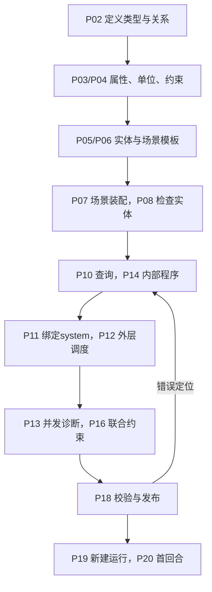

# 一、从空白模型到首次演练

```mermaid
flowchart TD
 A["P02 定义类型与关系"] --> B["P03/P04 属性、单位、约束"]
 B --> C["P05/P06 实体与场景模板"]
 C --> D["P07 场景装配，P08 检查实体"]
 D --> E["P10 查询，P14 内部程序"]
 E --> F["P11 绑定system，P12 外层调度"]
 F --> G["P13 并发诊断，P16 联合约束"]
 G --> H["P18 校验与发布"]
 H --> I["P19 新建运行，P20 首回合"]
 H -->|"错误定位"| E
```

页面呈现：对象创建后进入草稿；每步的引用选择器只选已存在且兼容的对象。发布页面统一固定版本。首次进入运行不自动结算。场景初值与模板默认值可能不同，P05显示默认、P07显示实例覆盖，P20显示运行值。
