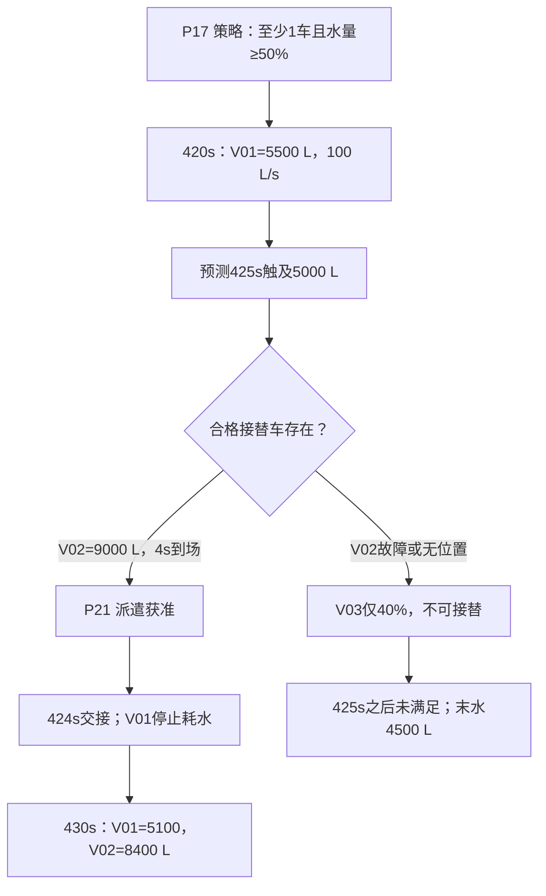

# 三、提前接替与不满足分支

```mermaid
flowchart TD
 A["P17 策略：至少1车且水量≥50%"] --> B["420s：V01=5500 L，100 L/s"]
 B --> C["预测425s触及5000 L"]
 C --> D{"合格接替车存在？"}
 D -->|"V02=9000 L，4s到场"| E["P21 派遣获准"]
 E --> F["424s交接；V01停止耗水"]
 F --> G["430s：V01=5100，V02=8400 L"]
 D -->|"V02故障或无位置"| H["V03仅40%，不可接替"]
 H --> I["425s之后未满足；末水4500 L"]
```

P28展示时间区间与候选排除原因；P25区分预测、派遣、到达、交接事件。V02到达前在前往状态满足策略“前往或处置”资格，但V01按更严格的到场交接规则保持处置，避免物理服务中断。两车短暂重叠符合“至少1辆”，不得误用“恰好1辆”。
