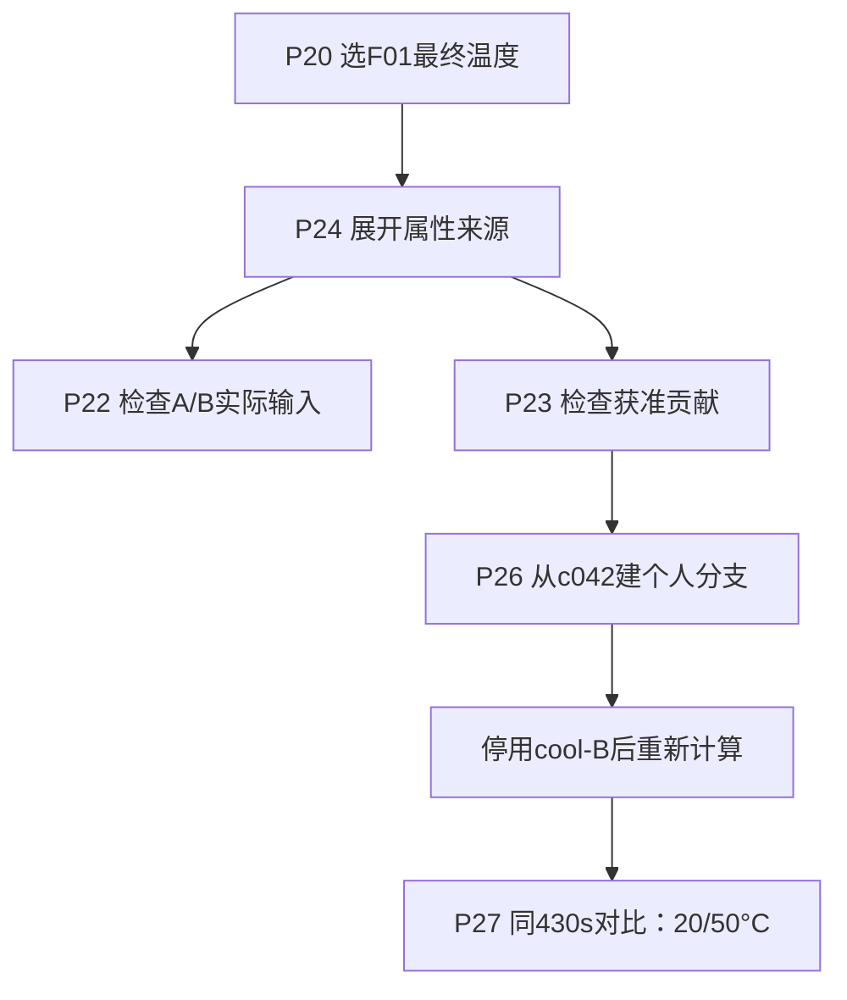

# 四、来源分析与反事实

```mermaid
flowchart TD
 A["P20 选F01最终温度"] --> B["P24 展开属性来源"]
 B --> C["P22 检查A/B实际输入"]
 B --> D["P23 检查获准贡献"]
 D --> E["P26 从c042建个人分支"]
 E --> F["停用cool-B后重新计算"]
 F --> G["P27 同430s对比：20/50°C"]
```

来源图解释程序如何得到结果；事件链解释已记录的业务关系；分支比较对同一基准和时间的结果做反事实检查。三者跳转互通，不能把单条时间顺序当因果证据。
